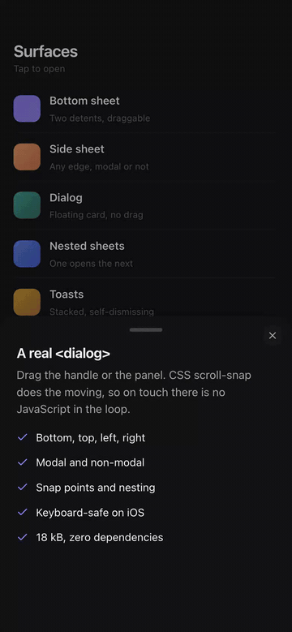

# scrollsheet

Bottom sheets for React that feel native. Because they are.



One primitive for bottom sheets, drawers, modal dialogs, side panels, and toasts. A real `<dialog>` in the top layer. The browser's own scroll engine for gestures. Spring physics compiled to CSS `linear()`. <!--size:index.gzip:1-->17.9<!--/size--> kB gzipped, <!--size:index.brotli:1-->15.9<!--/size--> kB brotli, plus a 3.9 kB stylesheet. React 18+.

## Why another drawer

[vaul](https://github.com/emilkowalski/vaul) is the React drawer nearly everyone ships: 37 million downloads a week. Its bug tracker tells one story over and over: pointer tracking fights the browser. scrollsheet takes the opposite bet: **don't simulate the gesture, be the scroll.**

1. **The sheet is a native `<dialog>`.** Top layer, so no z-index wars. Focus containment, Esc, and background inerting come from the platform.
2. **The drag is a native scroll.** A full-viewport `scroll-snap` container; detents are snap stops. 1:1 tracking, momentum, and rubber-banding run on the compositor. There is no drag code to have bugs in.
3. **The motion is a real spring**, compiled to a CSS `linear()` timing function at build time. No animation loop, no motion library.
4. **Scroll handoff is free.** At the top detent the browser chains the gesture into your content on its own. The `UISheetPresentationController` interaction, emergent rather than implemented.

Your page never gets touched. No `position: fixed` body hacks, no scroll restoration bugs, no layout shift.

## Install

```sh
bun add scrollsheet   # or npm/pnpm/yarn
```

## Use

```tsx
import { Sheet } from 'scrollsheet';
import 'scrollsheet/styles.css';

<Sheet.Root>
  <Sheet.Trigger>Open</Sheet.Trigger>
  <Sheet.Content className="my-sheet">
    <Sheet.Handle />
    <Sheet.Title>Title</Sheet.Title>
    <Sheet.Description>Says what this sheet is for.</Sheet.Description>
    <Sheet.Close>Done</Sheet.Close>
  </Sheet.Content>
</Sheet.Root>
```

`Sheet.*` is client-only: state, event handlers, real DOM. In Next.js App Router, add `'use client'` to the file that renders it, same as any other interactive component.

The stylesheet carries mechanics only; visuals are yours via `className`. No bundler CSS handling? Import everything from `scrollsheet/auto` instead: same components with the stylesheet embedded, injected the first time a sheet opens (also the entry for Shadow DOM and CSP-`nonce` setups).

Design systems and other libraries that re-bundle their CSS: if your pipeline statically compiles custom properties away (postcss-css-variables and similar), it destroys the runtime `--scrollsheet-*` variables the stylesheet's geometry runs on, and sheets break in subtle ways. Import from `scrollsheet/auto` there instead; the injected stylesheet never enters your build.

### Detents

```tsx
<Sheet.Root detents={[0.35, 0.7, 'full']} activeDetent={active} onActiveDetentChange={setActive}>
```

A detent is `'content'` (the default), `'medium'`, `'full'`, a fraction, or `'320px'`. The handle cycles detents on click and moves between them with arrow keys.

### Centered dialogs

```tsx
<Sheet.Root side="center">           // a content-sized modal, zoom+fade, your CSS owns the width
<Sheet.Root desktopSide="center">    // bottom sheet on phones, that modal at 768px and up
```

Same component, same props, same focus behavior. [Guide](https://scrollsheet.dev/docs/presentation/centered-dialog), [responsive profiles](https://scrollsheet.dev/docs/presentation/responsive-profiles).

### API

| Component | What it is |
| --- | --- |
| `Sheet.Root` | State owner. `open` / `onOpenChange`, `detents` / `activeDetent`, `side` (any edge or `'center'`), `desktopSide` / `desktopBreakpoint`, `modal`, the `dismissible` family, `actionsRef` (`open()` / `close()` / `snapTo(detent)`), plus travel, keyboard, and gesture tuning props |
| `Sheet.Trigger` | Button wired with `aria-haspopup` / `aria-expanded` |
| `Sheet.Content` | The `<dialog>`, backdrop, scroll track, and panel |
| `Sheet.Handle` | Grabber pill: click cycles detents, arrows move, down-arrow at the lowest detent dismisses. `variant="floating"` overlays full-bleed content; `variant="outside"` floats the pill in the backdrop above the sheet |
| `Sheet.Title` / `Sheet.Description` | Wire `aria-labelledby` / `aria-describedby` |
| `Sheet.Close` | Closes on click. Self-closing `<Sheet.Close />` renders a styled ✕ button, top-right, 44px hit area, `aria-label` included |

Also exported: `DetentSpec`, `Side`, `SheetActions`, `TravelInfo`, `spring(config?)`, `isSupported()`. Styling hooks (`data-scrollsheet-state`, `--scrollsheet-progress`, `--scrollsheet-travel: none`, and the rest) and the full prop reference: [scrollsheet.dev/docs/reference/api](https://scrollsheet.dev/docs/reference/api).

### Also built in

- **Nested sheets.** A `Sheet.Root` inside another sheet's `Content`; the parent recedes iOS-style.
- **Nested scrollers.** Mark an inner list `data-scrollsheet-nested-scroll`: it scrolls, and at its top the same swipe continues as sheet travel.
- **Content morph.** A `'content'` detent springs to new content height instead of jumping.
- **Keyboard engine.** `visualViewport`-tracked insets so the keyboard never reveals the page through a gap (the classic vaul bug). Works on every side; `keyboardExpands` promotes a peek-detent sheet to its tallest detent while the keyboard is up.
- **Radix Dialog drop-in.** `import { Dialog } from 'scrollsheet'` keeps @radix-ui/react-dialog JSX working against the centered presentation, `data-state` animation CSS included; radix-only props warn once in dev with the replacement recipe. [Migration guide](https://scrollsheet.dev/docs/migrating/from-radix-dialog).
- **vaul drop-in.** `import { Drawer } from 'scrollsheet'` keeps vaul's API and `data-vaul-*` attributes; props that existed to fight the page warn once in dev. [Migration guide](https://scrollsheet.dev/docs/migrating/from-vaul).
- **Toasts, no Sonner knowledge required.** `import { toast, Toaster, useToasts } from 'scrollsheet'` styles with `.scrollsheet-toast` classes and `--scrollsheet-toast-*` custom properties: `.promise()`, update-by-id, all six positions with per-toast overrides, swipe-to-dismiss with a velocity flick. Already on Sonner? Your `.sonner-toast` CSS still matches, unchanged, and `useSonner`/`toasterId` keep working; fresh integrations can drop the mirrors with `sonnerCompat={false}`. [Migration guide](https://scrollsheet.dev/docs/migrating/from-sonner).
- **Smaller things.** Desktop mouse drag, the `fill` prop, Shadow DOM injection, `themeColorDimming`, hidden scrollbars with an overlay thumb.
- **Agent skills.** [`skills/`](skills/) ships `migrate-from-vaul`, `migrate-from-sonner`, `migrate-from-radix-dialog`, and `build-with-scrollsheet` for coding agents.
- **Motion core (experimental).** `scrollsheet/motion` is the React-free layer the sheet runs on: closed-form spring solver, interruptible WAAPI wrapper, scroll tween. 1.6 kB gzipped standalone.
- **Zero-config entry.** `scrollsheet/auto` embeds the stylesheet and injects it on first open: no CSS import needed, <!--size:auto.gzip:1-->22.1<!--/size--> kB gzip for `Sheet` against the default entry's <!--size:index.gzip:1-->17.9<!--/size-->.

Focus containment comes from the platform's `showModal()`, not a JS focus trap. On open, focus lands on the panel so mobile keyboards don't pop unasked; use native `autofocus` to override.

## The competition, honestly

| | scrollsheet | vaul | Silk | react-modal-sheet |
| --- | --- | --- | --- | --- |
| Runtime deps | **0** | Radix Dialog (+24 transitive) | 0 | Motion (peer) |
| Native `<dialog>` / top layer | **yes** | no | no | no |
| Gesture engine | native scroll | pointer events | native scroll | Motion drag |
| Toasts | **yes, sonner drop-in** | no | yes | no |
| Lightbox | **yes** | no | yes | no |
| No-`<dialog>` browsers (~4%) | plain modal, no gestures | **full support** | **full support** | **full support** |
| License | **MIT** | MIT | commercial for advanced use | MIT |
| Price | **free** | free | paid license for the full set | free |

Building on `<dialog>` is a real trade. The others portal a plain `<div>`, so their full experience reaches the ~4% of browsers with no `<dialog>` (Opera Mini, some old in-app WebViews, iOS ≤15.3), where scrollsheet degrades to a static modal: backdrop, tap-to-close, Escape, content reachable, gestures gone. If pixel-identical drag on iOS 15.3 is a requirement, this is the wrong library.

## Browser support

`<dialog>`: about 96% global. The spring easing needs CSS `linear()` (Chrome 113+, Safari 17.2+, Firefox 112+); below that, a plain ease-out at the same duration. Chrome/Edge 115+ and Safari 26+ run the backdrop dim and `--scrollsheet-progress` as compositor-side scroll-driven animations; everywhere else the same values update from JS. Below Safari 15.4, the static-modal fallback above, no code required. Full matrix: [browser support docs](https://scrollsheet.dev/docs/browser-support).

Want a different experience for that ~4% instead of the built-in fallback? Check client-side, after mount:

```tsx
import { Sheet, isSupported } from 'scrollsheet';

const [supported, setSupported] = useState(false);
useEffect(() => setSupported(isSupported()), []);

if (!supported) return <LegacyModal open={open} onClose={onClose} />;
return <Sheet.Root open={open} onOpenChange={onClose}>...</Sheet.Root>;
```

## shadcn/ui

Every primitive ships as a registry item:

```sh
bunx shadcn@latest add https://raw.githubusercontent.com/ansumanshah/scrollsheet/main/registry/drawer.json
```

Items: `drawer`, `sheet`, `dialog`, `confirm`, `share-sheet`, `sidebar`, `toast`. Each writes one file into `components/ui/` with shadcn's default styling applied, wrapping the primitives above. Swap `drawer.json` in the URL for any of them.

## Roadmap

**Next**: `scroll()` and `view()` animation helpers over the motion core. **Later**: framework adapters (Vue, Svelte, Solid) over the same React-free core.

## Development

```sh
bun install
bun run dev        # docs site with live examples (localhost:4321)
bun test           # unit tests
bun run verify     # the full gate
```

See [CONTRIBUTING.md](https://github.com/ansumanshah/scrollsheet/blob/main/CONTRIBUTING.md) and the [CHANGELOG](https://github.com/ansumanshah/scrollsheet/blob/main/CHANGELOG.md).

MIT © [Ansuman Shah](https://github.com/ansumanshah)
